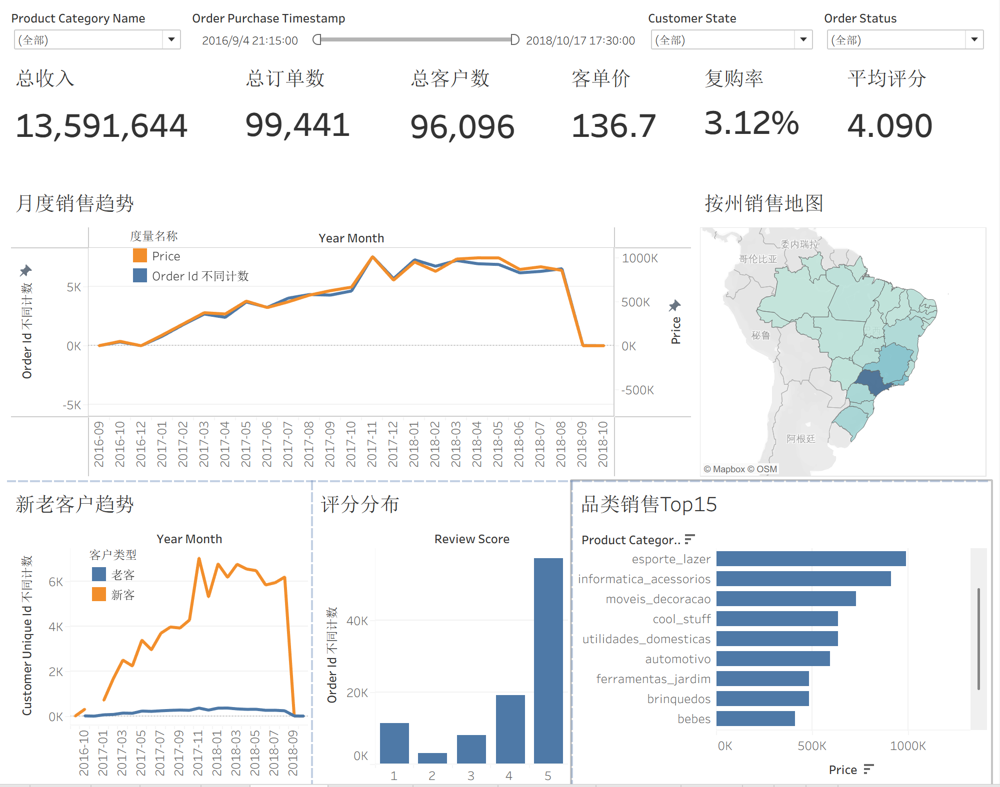
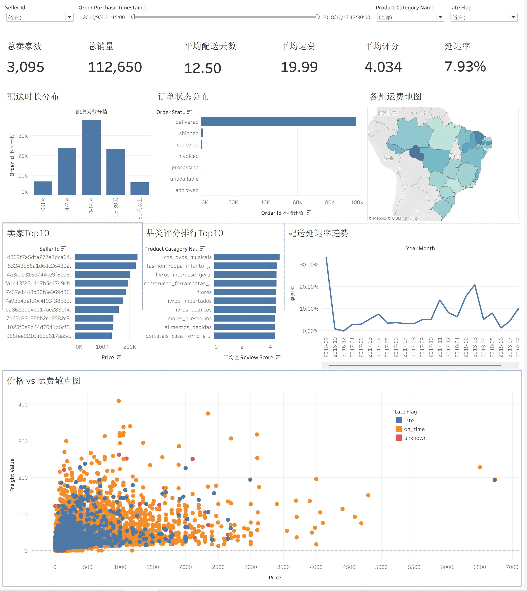

# Olist 电商数据仓库与 BI 分析项目

基于 Olist 巴西电商公开数据集，使用 **PostgreSQL + SQL + Python + Tableau** 构建电商数据仓库与 BI 分析项目。

项目采用 **ODS → DWD → ADS** 的分层架构，对原始电商数据进行分层存储、清洗、标准化、业务关联与指标加工，并通过 Python 对 ODS、DWD 层的数据处理过程进行监控，最终在 ADS 层形成面向业务分析的数据集，并使用 Tableau 构建销售分析与运营分析 Dashboard。

---

## 📌 项目简介

Olist 是巴西电商平台，本项目使用 Olist 公开的电商数据集，数据涵盖订单、客户、卖家、商品、支付、评价、地理位置等多个业务主题。

项目从原始 CSV 数据出发，通过 PostgreSQL 建立数据仓库分层，对数据进行清洗、标准化和业务关联，并进一步构建 ADS 分析数据集，为销售与运营分析提供统一的数据基础。

最终使用 Tableau 构建可交互的 BI Dashboard，从销售、客户、商品、卖家、配送和订单等多个维度进行分析。

---

## 📂 项目目录结构

```text
new_olistecommerce/
│
├── datasets/
│   └── Olist 原始数据集
│
├── docs/
│   └── 数据流向图
│   └── 实体关系图（ER图）
│
├── scripts/
│   │
│   ├── ODS/
│   │   └── init_ods.sql
|   |   └── load_raw_to_postgres.py
│   │
│   ├── DWD/
│   │   └── ddl_dwd.sql
│   │   └── proc_load_dwd
│   │   └── load_dwd.py
│   │ 
│   └── ADS/
│       └── vw_exec_sales_overview.sql
│       └── vw_seller_delivery_performance.sql 
│
├── tests/
│   └── test_dwd.sql  
│
├── BI/
│   └── 销售看板.png
│   └── 运营看板.png
│
├── LICENSE
│
└── README.md
```

---

## 🛠️ 技术栈

| 技术 | 用途 |
|---|---|
| PostgreSQL | 数据仓库建设、数据存储及 SQL 数据处理 |
| SQL | 数据清洗、表关联、数据转换、指标计算与 ADS 数据加工 |
| Python | ODS、DWD 层数据处理过程监控 |
| Tableau | 数据可视化、Dashboard 构建及交互式分析 |
| Git / GitHub | 项目版本管理与代码托管 |

---

## 🏗️ 项目架构

```text
Olist CSV Dataset
        │
        ▼
┌─────────────────────┐
│       ODS           │
│  原始数据存储层      │
└─────────────────────┘
        │
        │ Python 监控
        ▼
┌─────────────────────┐
│       DWD           │
│ 数据清洗与明细层     │
│ 标准化 / 业务关联    │
└─────────────────────┘
        │
        │ Python 监控
        ▼
┌─────────────────────┐
│       ADS           │
│   业务分析应用层     │
│ 指标加工 / 分析数据  │
└─────────────────────┘
        │
        ▼
┌─────────────────────┐
│      Tableau        │
│   BI Dashboard      │
└─────────────────────┘
```

其中：

- **ODS** 负责保存来源数据，为后续数据处理提供基础
- **DWD** 负责数据清洗、标准化以及不同业务数据之间的关联
- **Python** 用于对 ODS、DWD 层的数据处理过程进行监控
- **ADS** 根据业务分析需求进一步加工数据和指标
- **Tableau** 连接分析数据并构建最终 BI Dashboard

---

## 📊 BI 分析

### 销售看板



核心指标包括：

- 总收入
- 总订单数
- 总客户数
- 客单价
- 复购率
- 平均评分

分析内容包括：

- 月度销售趋势
- 各州销售地图
- 品类销售 Top15
- 新老客户趋势
- 评分分配

### 运营看板


核心指标包括：

- 总卖家数
- 总销量
- 平均配送天数
- 平均运费
- 平均评分
- 延迟率

分析内容包括：

- 配送时长分布
- 订单状态分布
- 各州运费地图
- 品类评分 Top10
- 卖家 Top10
- 配送延迟率趋势
- 价格 vs 运费散点图

---

## 📚 数据来源

本项目使用 Olist Brazilian E-Commerce Public Dataset。

数据来源于 Olist 巴西电商公开数据集，包含订单、客户、卖家、商品、支付、评价及地理位置等相关数据。

---
